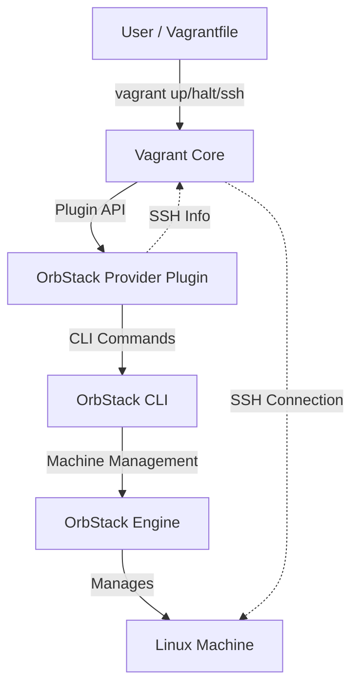
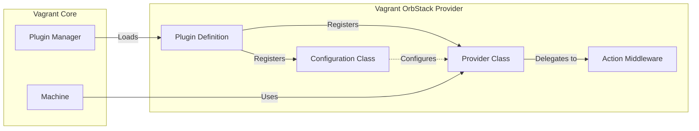
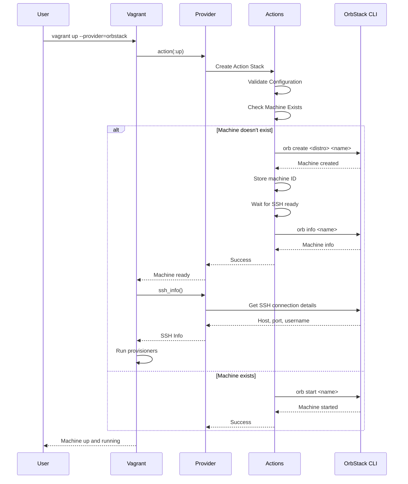
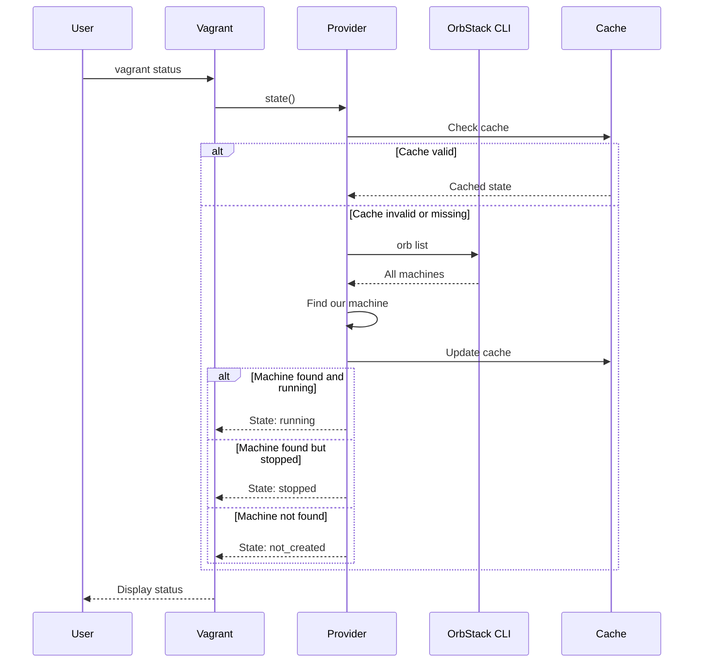
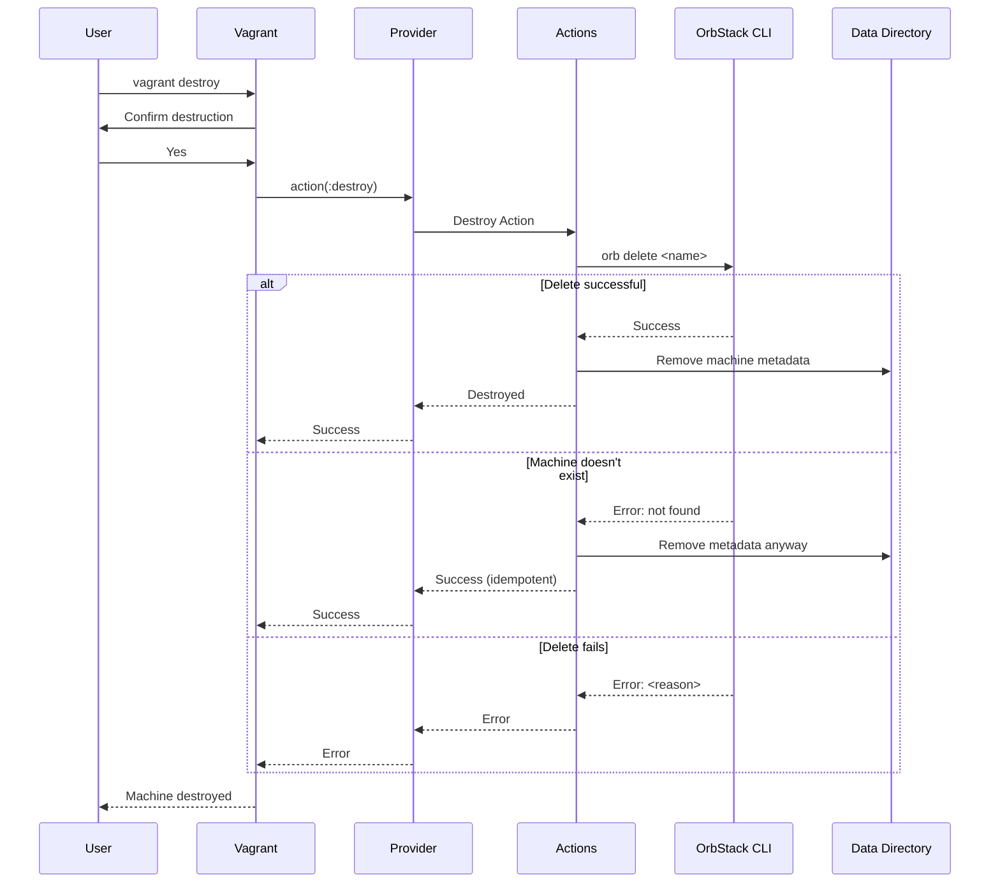
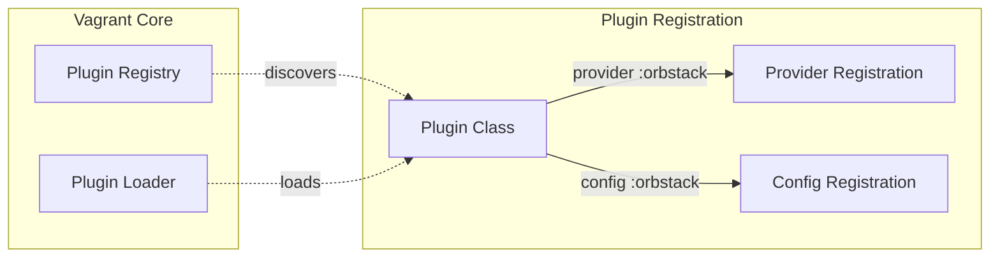
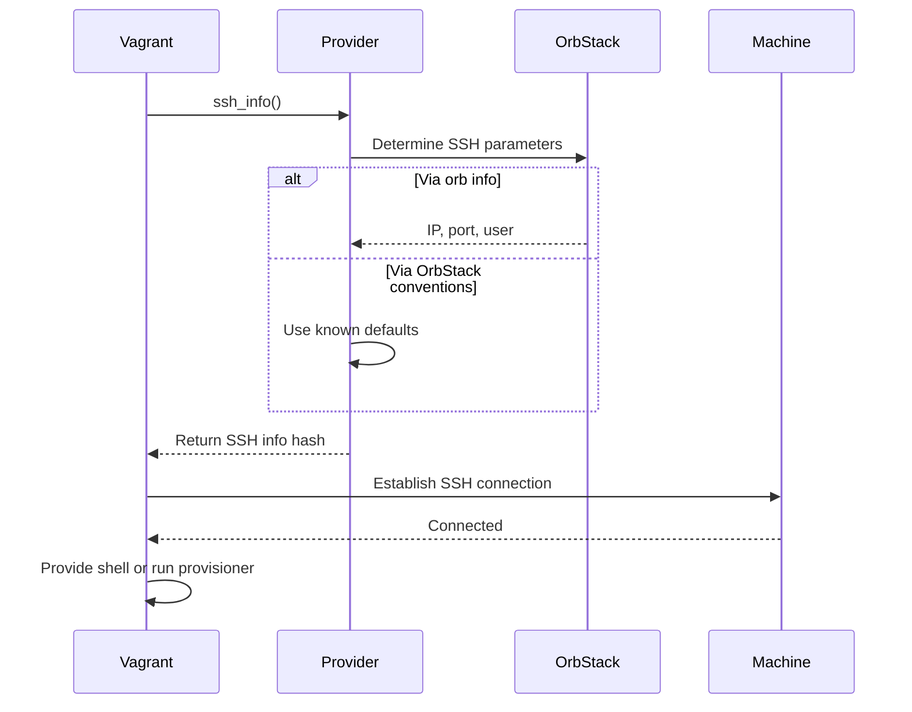

# Design Document: Vagrant OrbStack Provider

## Overview

This document describes the technical design and architecture of the Vagrant OrbStack provider. It complements the [Product Requirements Document](./PRD.md) by detailing the "how" of implementation.

## Architecture

### System Context

The provider acts as a bridge between Vagrant's plugin system and OrbStack's CLI interface, translating Vagrant operations into OrbStack machine management commands.



### Component Architecture

The provider follows Vagrant's plugin architecture patterns with three primary components working together to deliver functionality.



**Plugin Definition**
- Registers the provider with Vagrant under the name `orbstack`
- Declares configuration class for provider-specific settings
- Hooks into Vagrant's plugin loading mechanism

**Configuration Class**
- Defines user-configurable options in Vagrantfile
- Validates configuration values
- Provides defaults for optional settings
- Supports: distribution selection, version specification, custom naming

**Provider Class**
- Implements Vagrant's provider interface
- Manages machine state and metadata
- Delegates operations to action middleware
- Returns SSH connection information
- Reports machine state to Vagrant

**Action Middleware**
- Implements specific operations as composable middleware
- Provides: Create, Destroy, Halt, Start, Reload, SSH Info
- Leverages Vagrant's built-in middleware where applicable
- Handles errors and edge cases

## Data Flow

### Machine Creation Flow



### State Query Flow



### Machine Destruction Flow



## Component Design

### Provider Class

The provider class is the primary interface between Vagrant and the OrbStack integration. It maintains machine state and coordinates actions.

**Responsibilities**:
- Implement Vagrant's provider interface contract
- Return capability flags (e.g., support for parallel operations)
- Delegate to action middleware for operations
- Provide SSH connection information
- Query and report machine state
- Manage machine metadata storage

**Key Methods**:
- `action(name)` - Returns action middleware for requested operation
- `ssh_info` - Provides SSH connection parameters
- `state` - Returns current machine state
- `to_s` - Returns human-readable provider description

**State Management**:
- Machine ID stored in Vagrant's data directory
- Metadata includes: OrbStack machine name, creation timestamp
- State queries delegated to OrbStack CLI
- Brief caching to avoid redundant CLI calls

**Machine Metadata Storage**:
- Machine ID stored in Vagrant's data directory (`@machine.data_dir`)
- Two-file storage strategy: ID file (plain text) + metadata file (JSON)
- Persistent across Vagrant sessions, enabling state recovery
- Graceful degradation on read errors (returns nil/empty)
- Fails fast on write errors (raises exceptions)

**Storage Locations**:
```
.vagrant/machines/<machine-name>/orbstack/
  ├── id                   # Machine ID (plain text)
  └── metadata.json        # Machine metadata (JSON)
```

**ID File Format** (`.vagrant/machines/<machine-name>/orbstack/id`):
```
<machine-id>
```

**Metadata File Format** (`.vagrant/machines/<machine-name>/orbstack/metadata.json`):
```json
{
  "machine_id": "<uuid>",
  "orbstack_machine_name": "vagrant-default-abc123",
  "created_at": "2025-11-18T10:30:00Z",
  "provider_version": "0.1.0"
}
```

**API Methods**:
- `machine_id_changed` - Vagrant callback for persisting ID changes
- `read_machine_id` - Read machine ID from storage
- `write_machine_id(id)` - Persist machine ID to storage
- `read_metadata` - Read metadata hash from storage
- `write_metadata(hash)` - Persist metadata hash to storage

**Error Handling**:
- **Read Operations**: Return safe defaults (nil or {}) on errors
- **Write Operations**: Raise exceptions on permission/disk errors
- **Logging**: All errors logged via Vagrant UI (warn/error)
- **Recovery**: Missing files treated as "not created" state

**Usage Example**:
```ruby
# In provider initialization
machine_id = read_machine_id
metadata = read_metadata

# After machine creation
write_machine_id('new-machine-123')
write_metadata({
  'machine_id' => 'new-machine-123',
  'orbstack_machine_name' => 'vagrant-default-abc123',
  'created_at' => Time.now.utc.iso8601,
  'provider_version' => VERSION
})

# Vagrant callback
def machine_id_changed
  write_machine_id(@machine.id) if @machine.respond_to?(:id) && @machine.id
end
```

**Design Decisions**:
- **Two Files**: Separate ID file follows Vagrant conventions; metadata file adds extensibility
- **JSON Format**: Human-readable, easy to debug, extensible schema
- **Minimal Schema**: Only essential fields for MVP (YAGNI principle)
- **No Caching**: Direct file I/O sufficient for infrequent operations
- **No Locking**: Vagrant single-process model doesn't require file locking

### Configuration Class

The configuration class enables users to customize provider behavior through their Vagrantfile.

**Configuration Options**:

| Option | Type | Default | Description |
|--------|------|---------|-------------|
| `distro` | String | `"ubuntu"` | Linux distribution to use |
| `version` | String | Latest | Distribution version (if applicable) |
| `machine_name` | String | Auto-generated | Custom name for OrbStack machine |

**Validation**:
- Distro must be in supported list
- Version must be valid for chosen distro (if specified)
- Machine name must follow OrbStack naming rules
- Conflicts flagged during configuration phase

**Example Configuration**:
```ruby
Vagrant.configure("2") do |config|
  config.vm.box = "ubuntu/jammy64"

  config.vm.provider :orbstack do |os|
    os.distro = "ubuntu"
    os.version = "22.04"
  end
end
```

### Action Middleware

Actions are implemented as Rake middleware, allowing composition and reuse of functionality.


**Core Actions**:

**Create**
- Validates configuration completeness
- Verifies OrbStack is installed and running
- Checks if machine already exists
- Executes `orb create` with appropriate parameters
- Waits for machine to reach SSH-ready state
- Stores machine metadata for future operations

**Destroy**
- Prompts for confirmation (Vagrant handles this)
- Executes `orb delete` command
- Removes machine metadata
- Handles idempotency (success if machine already gone)

**Halt** (✅ Implemented)
- Validates machine ID exists
- Executes `orb stop` command via OrbStackCLI.stop_machine
- Invalidates state cache for accurate subsequent queries
- Displays user-friendly progress message with machine ID
- Returns success when halted
- Idempotent (safe to halt already stopped machine)

**Start** (✅ Implemented)
- Validates machine ID exists
- Executes `orb start` command via OrbStackCLI.start_machine
- Invalidates state cache for accurate subsequent queries
- Displays user-friendly progress message with machine ID
- Returns machine to running state
- Idempotent (safe to start already running machine)
- **Note**: The Start action is automatically invoked by the Create action when resuming a stopped machine via `vagrant up`

**Reload** (✅ Implemented)
- Composes Halt + Start actions for restart workflow
- Optionally includes provisioning via Vagrant's Builtin::Provision
- Validates machine ID via composed actions (not directly)
- Executes halt then start sequence via action builder composition
- Displays user-friendly progress messages from composed actions
- Supports `--provision` and `--no-provision` flags
- Idempotent (safe to reload in any state - halt/start handle specifics)
- **Note**: This is a Composition Action (see "Action Patterns" section) that orchestrates existing actions rather than directly interacting with OrbStack CLI

**Implementation Pattern**:
- Action class: `lib/vagrant-orbstack/action/reload.rb` (composition marker)
- Provider registration: `:reload` case in `Provider#action` method
- Action composition: Halt → Start → (optional) Provision
- Error handling: Implicit via middleware chain (stops on first failure)
- State management: Handled by composed Halt and Start actions

**SSH Info**
- Queries OrbStack for machine details
- Determines SSH connection parameters
- Returns hash with host, port, username, auth method
- Leverages OrbStack's built-in SSH server

### Action Patterns

This provider implements two distinct action patterns for different use cases:

#### Direct Action Pattern

Used when actions need to directly interact with OrbStack CLI and manage state.

**Characteristics**:
- Includes `MachineValidation` module for ID validation
- Directly calls `Util::OrbStackCLI` methods
- Invalidates state cache after state changes
- Provides user feedback via `env[:ui]`

**Examples**: Create, Halt, Start, Destroy

**Template**:
```ruby
class MyAction
  include MachineValidation

  def initialize(app, env)
    @app = app
  end

  def call(env)
    machine_id = validate_machine_id!(env[:machine], 'operation_name')
    env[:ui].info("Performing operation...")

    Util::OrbStackCLI.operation(machine_id)
    env[:machine].provider.invalidate_state_cache

    @app.call(env)
  end
end
```

#### Composition Action Pattern

Used when actions orchestrate existing actions without direct CLI interaction.

**Characteristics**:
- Does NOT include `MachineValidation` (composed actions validate)
- Coordinates multiple actions via Action::Builder
- No direct OrbStack CLI calls
- State management handled by composed actions

**Examples**: Reload (composes Halt + Start)

**Template**:
```ruby
class MyCompositionAction
  def initialize(app, env)
    @app = app
  end

  def call(env)
    # Optional pre-composition logic
    @app.call(env)
    # Optional post-composition logic
  end
end

# In Provider#action:
when :my_operation
  Vagrant::Action::Builder.new.tap do |b|
    b.use Action::FirstAction
    b.use Action::SecondAction
    b.use Action::MyCompositionAction
  end
```

### Choosing the Right Pattern

**Use Direct Action Pattern when**:
- Performing atomic OrbStack CLI operations
- Need machine ID validation
- Managing state cache directly
- Providing operation-specific user feedback

**Use Composition Action Pattern when**:
- Orchestrating multiple existing actions
- No direct CLI interaction needed
- State management delegated to composed actions
- Building complex workflows from simple operations

## Integration Points

### Vagrant Plugin System

The provider integrates with Vagrant through the v2 plugin API.



**Registration**:
- Gem name: `vagrant-orbstack`
- Provider name: `orbstack`
- Plugin class inherits from `Vagrant.plugin("2")`
- Registers with provider and config hooks

**Loading**:
- Vagrant auto-discovers gems with `vagrant-` prefix
- Plugin loads when user specifies `--provider=orbstack`
- Configuration loads when Vagrantfile contains provider block

### OrbStack CLI Interface

All OrbStack interactions occur through its command-line interface.

**Command Patterns**:

| Operation | Command | Output Parsing |
|-----------|---------|----------------|
| Create | `orb create <distro> <name>` | Success/error message |
| Delete | `orb delete <name>` | Success confirmation |
| Start | `orb start <name>` | Status update |
| Stop | `orb stop <name>` | Status update |
| List | `orb list` | Structured machine list |
| Info | `orb info <name>` | JSON or structured output |

**Execution Strategy**:
- Shell out to `orb` command via Ruby subprocess
- Capture stdout, stderr, and exit status
- Parse output based on operation
- Handle command failures gracefully
- Timeout protection for long operations

**Error Handling**:
- Command not found → OrbStack not installed
- Non-zero exit code → Parse error message
- Timeout → Operation taking too long
- Parse failure → Unexpected output format

### SSH Integration

SSH connectivity leverages Vagrant's built-in SSH handling.



**SSH Info Hash**:
- `host` - IP address or hostname
- `port` - SSH port (typically 22)
- `username` - Default user for distro
- `private_key_path` - SSH key location (if used)

**Authentication**:
- OrbStack handles SSH key management
- Provider may leverage SSH agent forwarding
- Passwordless access via OrbStack's integration

## Technical Decisions

### Decision: CLI Interface vs. API

**Context**: OrbStack could be integrated via CLI commands or a potential API/library.

**Decision**: Use CLI interface exclusively.

**Rationale**:
- OrbStack provides robust CLI tools as primary interface
- No official Go library or API documented
- CLI is stable and well-documented
- Simplifies implementation (no FFI or networking)
- Easier to debug and maintain
- Aligns with how users interact with OrbStack directly

**Tradeoffs**:
- Slight overhead from process spawning
- Output parsing required
- Potential version compatibility issues
- Less performant than native API would be

**Mitigation**:
- Cache frequently queried information
- Batch operations where possible
- Version detection and compatibility checks

### Decision: State Caching Strategy

**Context**: Querying machine state requires shelling out to OrbStack CLI.

**Decision**: Implement brief (5-second) caching of state queries.

**Rationale**:
- State queries happen frequently during Vagrant operations
- CLI calls add 100-200ms latency each
- State rarely changes during single Vagrant command
- Caching improves user experience significantly

**Tradeoffs**:
- Potential stale state if machine changes externally
- Added complexity in cache invalidation
- Memory overhead (minimal)

**Mitigation**:
- Short TTL keeps cache fresh
- Cache invalidation on state-changing operations
- Users can force refresh if needed

### Decision: Machine Naming Convention

**Context**: OrbStack machines need names; Vagrant uses box names and IDs.

**Decision**: Auto-generate machine names from Vagrant machine name and unique ID.

**Pattern**: `vagrant-<machine-name>-<short-id>`

**Rationale**:
- Predictable naming for debugging
- Avoids naming collisions across projects
- Easy to identify Vagrant-managed machines
- Supports Vagrant's multi-machine scenarios

**Example**: `vagrant-default-a3b2c1` for default machine

### Decision: Distribution Mapping

**Context**: Vagrant boxes use names like "ubuntu/jammy64"; OrbStack uses "ubuntu" with optional versions.

**Decision**: Maintain explicit mapping between box names and OrbStack distros.

**Implementation**:
- Configuration specifies OrbStack distro explicitly
- Provider includes mapping helper for common boxes
- Documentation guides users on distribution selection

**Rationale**:
- Clear, explicit configuration
- No magic or assumptions
- Handles cases where box names don't map directly
- Allows flexibility for future distributions

### Decision: Synced Folder Approach

**Context**: Vagrant's synced folders vs. OrbStack's native file sharing.

**Decision**: Document OrbStack's native approach; defer automatic mounting.

**Initial Approach**:
- Document `/mnt/mac` and `~/OrbStack` access patterns
- Let users leverage OrbStack's built-in sharing
- Don't attempt to mimic VirtualBox-style synced folders

**Future Enhancement**:
- Could implement automatic mounting of configured folders
- Would require understanding OrbStack's mount capabilities
- May not provide value over native approach

**Rationale**:
- OrbStack's native sharing is performant and simple
- Automatic mounting adds complexity
- YAGNI - defer until users request it
- Documentation may be sufficient

## Implementation Considerations

### Error Handling Strategy

Robust error handling ensures good user experience and debuggability.

**Categories**:

**Dependency Errors** (OrbStack not installed)
- Detect missing `orb` command
- Provide clear installation instructions
- Link to OrbStack download page

**Configuration Errors** (invalid settings)
- Validate during config phase
- Clear error messages with fix suggestions
- Fail early before expensive operations

**Operational Errors** (machine creation fails)
- Parse OrbStack error messages
- Add context about what was attempted
- Suggest corrective actions
- Clean up partial state

**State Errors** (unexpected machine state)
- Handle idempotent operations gracefully
- Don't fail if outcome is achieved
- Log warnings for unexpected conditions

### Testing Strategy

Comprehensive testing ensures reliability across environments.

**Unit Tests**:
- Configuration validation
- Action middleware logic
- State parsing and caching
- Error handling paths

**Integration Tests**:
- Actual OrbStack CLI interactions
- Full lifecycle (create, ssh, provision, destroy)
- Multiple distributions
- Error scenarios

**Compatibility Tests**:
- Multiple Vagrant versions
- Multiple OrbStack versions
- Different macOS versions
- Apple Silicon and Intel

**Manual Testing**:
- Real-world Vagrantfiles
- Common provisioners
- Multi-machine scenarios
- Documentation accuracy

### Performance Considerations

The provider should feel fast despite CLI overhead.

**Optimization Opportunities**:

**State Caching**
- Cache machine state for short duration
- Invalidate on state-changing operations
- Reduces redundant CLI calls

**Parallel Operations**
- Support Vagrant's parallel flag where safe
- OrbStack handles concurrent operations well
- Be mindful of race conditions

**Lazy Loading**
- Don't query info until needed
- Defer expensive operations
- Load on demand rather than upfront

**CLI Efficiency**
- Batch queries when possible
- Use most efficient commands
- Avoid redundant calls

### Logging and Debugging

Comprehensive logging aids troubleshooting and development.

**Logging Levels**:

**Debug**
- Every CLI command and output
- Cache hits and misses
- State transitions
- Detailed operation flow

**Info**
- Major operations (create, destroy)
- Configuration values
- SSH connection details
- Success confirmations

**Warn**
- Unexpected but handled conditions
- Deprecated options
- Performance issues
- Recovery actions

**Error**
- Failed operations
- Invalid configurations
- Missing dependencies
- Unrecoverable states

**Implementation**:
- Use Vagrant's built-in logger
- Follow Vagrant logging conventions
- Include context in messages
- Sanitize sensitive information

### Security Considerations

Security should be considered throughout the implementation.

**SSH Key Management**:
- Rely on OrbStack's key handling
- Don't generate or store keys unnecessarily
- Respect user's SSH agent
- Document security model

**Command Injection Prevention**:
- Sanitize all user input
- Use proper command construction
- Avoid shell string interpolation
- Validate machine names and paths

**Metadata Storage**:
- Store minimal information
- Don't persist credentials
- Use Vagrant's secure data directory
- Clean up on destroy

**Information Disclosure**:
- Sanitize logs of sensitive data
- Don't expose internal paths unnecessarily
- Be cautious with error messages

## Future Enhancements

### Potential Features (Post-MVP)

**Advanced Networking**
- Custom network configuration
- Port forwarding rules
- Multiple network interfaces
- Static IP assignment

**Resource Management**
- CPU limit configuration
- Memory allocation
- Disk size specification
- Resource quotas

**Snapshot Support**
- Save machine state
- Restore to snapshot
- Snapshot management
- Automated snapshots

**Box Format**
- Custom OrbStack box format
- Package machines as boxes
- Share pre-configured environments
- Private box repositories

**Enhanced Synced Folders**
- Automatic mount configuration
- Custom mount points
- Exclusion patterns
- Performance tuning

### Extension Points

The design allows for future extension without major refactoring:

**New Actions**
- Add middleware for new operations
- Compose with existing actions
- Leverage middleware pattern

**Configuration Options**
- Extend config class
- Maintain backwards compatibility
- Validate new options

**Distribution Support**
- Add to supported distro list
- Update mappings
- Test thoroughly

**CLI Evolution**
- Detect OrbStack version
- Support multiple CLI versions
- Graceful degradation

## References

### Vagrant Provider Development
- [Provider Plugin Documentation](https://developer.hashicorp.com/vagrant/docs/plugins/providers)
- [Plugin Development Guide](https://developer.hashicorp.com/vagrant/docs/plugins)
- [vagrant-aws source](https://github.com/mitchellh/vagrant-aws) - Reference implementation

### OrbStack Integration
- [OrbStack CLI Commands](https://docs.orbstack.dev/machines/commands)
- [Linux Machines Guide](https://docs.orbstack.dev/machines/)
- [OrbStack Documentation](https://docs.orbstack.dev/)

### Related Resources
- Vagrant Plugin Best Practices
- Ruby Subprocess Handling
- SSH Configuration

---

## Document History

| Version | Date | Changes | Author |
|---------|------|---------|--------|
| 1.0 | 2025-01-16 | Initial design document | Development Team |

---

**Note**: This design document should evolve as implementation progresses and new insights emerge.
