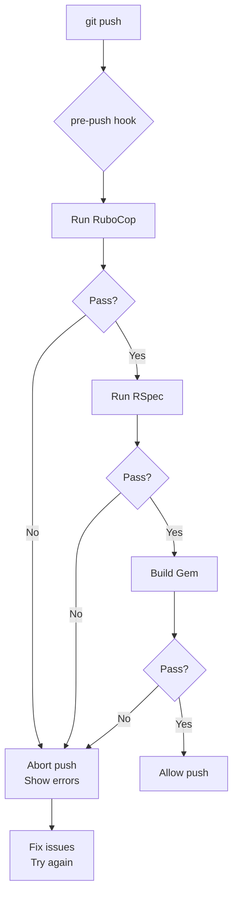

# Git Hooks Guide

## Overview

This project uses git hooks to ensure code quality before changes reach the remote repository. Hooks run the same checks as CI/CD pipelines, allowing you to catch issues locally.

## Installation

### One-Time Setup

Run the installation script from the project root:

```bash
./bin/install-git-hooks
```

This configures git to use hooks from `.githooks/` instead of `.git/hooks/`.

### Verification

Check that hooks are properly configured:

```bash
git config core.hooksPath
# Should output: .githooks
```

### Automatic Installation (Optional)

Add to your `~/.zshrc` or `~/.bashrc` to auto-install hooks after `bundle install`:

```bash
# Auto-install git hooks after bundle install
alias bundle='command bundle "$@" && [ -f ./bin/install-git-hooks ] && ./bin/install-git-hooks'
```

## Available Hooks

### pre-push

**When it runs**: Before every `git push`

**What it checks**:
1. **RuboCop** (linting) - `bundle exec rubocop`
2. **RSpec** (tests) - `bundle exec rspec`
3. **Gem Build** (gemspec validation) - `gem build vagrant-orbstack.gemspec`

**Why**: These are the same checks that run in GitHub Actions CI. Catching failures locally saves time and prevents broken builds.

**Output**:
```
===========================================
  Pre-Push Checks (Mirroring CI)
===========================================

→ Running RuboCop...
  ✓ RuboCop passed (no offenses)

→ Running RSpec tests...
  ✓ RSpec passed (all tests passing)

→ Building gem (validates gemspec)...
  ✓ Gem built successfully

===========================================
  All pre-push checks passed! ✓
  Safe to push to remote.
===========================================
```

**If checks fail**, the hook will:
- Display the failure details
- Prevent the push
- Suggest fixes

## Bypassing Hooks

### When to Bypass

**✅ Legitimate reasons**:
- Pushing work-in-progress to a personal branch
- Emergency hotfixes (with caution)
- Hooks are broken and need to be fixed

**❌ Bad reasons**:
- "I'm in a hurry" - CI will catch it anyway, wasting more time
- "Tests are slow" - They'll run in CI regardless
- "I'll fix it later" - Creates technical debt

### How to Bypass

```bash
# Bypass all hooks for one push
git push --no-verify
```

**Warning**: Bypassing hooks means CI will likely fail, blocking your PR until issues are fixed.

## Hook Workflow



## Troubleshooting

### Hook doesn't run

**Symptom**: Push succeeds without any checks running

**Cause**: Hooks path not configured

**Fix**:
```bash
./bin/install-git-hooks
```

### Hook fails but should pass

**Symptom**: Tests pass locally with `bundle exec rspec`, but fail in hook

**Possible causes**:
1. Different Ruby version (hook runs in your shell environment)
2. Uncommitted files affecting tests
3. Git state issues

**Debug**:
```bash
# Check Ruby version
ruby --version

# Run each check manually
bundle exec rubocop
bundle exec rspec
gem build vagrant-orbstack.gemspec
```

### Hook is too slow

**Symptom**: Hook takes a long time to run

**Analysis**:
- RuboCop: Usually < 2 seconds
- RSpec: Usually < 10 seconds
- Gem Build: Usually < 1 second
- **Total**: ~15 seconds

**Solutions**:
1. **Run tests in parallel** (future improvement)
2. **Skip gem build for draft pushes** (push with `--no-verify`, but run tests manually)
3. **Optimize slow tests** (investigate why tests are slow)

### Need to modify hooks

Hooks are in `.githooks/pre-push`. Edit as needed, then:

```bash
# Make sure hook is executable
chmod +x .githooks/pre-push

# Test manually
./.githooks/pre-push
```

## CI Integration

These hooks mirror the GitHub Actions CI workflow defined in `.github/workflows/ci.yml`:

| Hook Check | CI Job | Command |
|------------|--------|---------|
| RuboCop | `lint` | `bundle exec rubocop` |
| RSpec | `test` | `bundle exec rspec` |
| Gem Build | `build` | `gem build vagrant-orbstack.gemspec` |

**Philosophy**: "Shift left" - catch issues as early as possible (locally before CI).

## Best Practices

### Development Workflow

```bash
# 1. Make changes
vim lib/vagrant-orbstack/provider.rb

# 2. Run tests manually during development
bundle exec rspec spec/vagrant-orbstack/provider_spec.rb

# 3. Run full suite before committing
bundle exec rspec

# 4. Commit changes
git commit -m "feat: implement xyz"

# 5. Push - hooks run automatically
git push origin feat/my-branch
```

### When Hooks Fail

```bash
# Hook failed on RuboCop
→ Fix auto-correctable issues:
bundle exec rubocop --autocorrect

→ Fix remaining issues manually
→ Push again (hooks will re-run)
```

### Continuous Integration Loop

1. **Local development**: Hooks catch issues before push
2. **CI validation**: GitHub Actions runs same checks on PR
3. **Code review**: Reviewers see passing CI
4. **Merge**: Clean, validated code enters main branch

## Maintenance

### Adding New Checks

To add a new check to pre-push:

1. Edit `.githooks/pre-push`
2. Add check in the same pattern:
   ```bash
   print_section "Running New Check..."
   if new_command; then
     print_success "Check passed"
   else
     print_error "Check failed"
     ALL_CHECKS_PASSED=false
   fi
   ```
3. Update this documentation
4. Update `.github/workflows/ci.yml` to match

### Removing Hooks

To disable hooks entirely:

```bash
git config --unset core.hooksPath
```

Or temporarily:

```bash
git push --no-verify
```

## Related Documentation

- [CI/CD Workflow](../.github/workflows/ci.yml) - GitHub Actions configuration
- [Contributing Guide](../CONTRIBUTING.md) - Development workflow
- [Testing Guide](./TESTING.md) - How to write and run tests

---

## FAQ

**Q: Why not use Husky or Lefthook?**
A: Simple bash scripts are:
- Zero dependencies
- Easy to understand
- Easy to debug
- Fast to run

**Q: Can I customize hooks for my workflow?**
A: Yes! Hooks are in `.githooks/` - modify as needed for your team.

**Q: What if I disagree with a check?**
A: Discuss in GitHub issue. Hooks should reflect team consensus, not individual preference.

**Q: Do hooks run in CI?**
A: No - CI runs the same commands directly. Hooks are for local development only.

**Q: Can I have per-developer hook customization?**
A: Yes - create `.githooks/pre-push.local` and source it from the main hook. Add to `.gitignore`.
