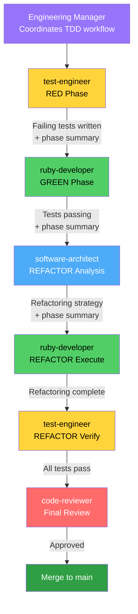
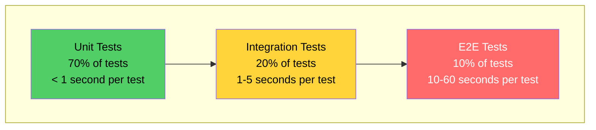

# Test-Driven Development (TDD) Workflow

## TDD Mandate

TDD is **mandatory for all code development in `lib/`**. No production code is written without corresponding tests.

## RED-GREEN-REFACTOR Cycle

### Agent Delegation Flow



### The Three Phases

| Phase | Goal | Owner | Output |
|-------|------|-------|--------|
| **RED** | Write failing test that specifies exact behavior | test-engineer | `/tmp/{issue-id}-red-phase-summary.md` |
| **GREEN** | Write minimal code to make test pass | ruby-developer | `/tmp/{issue-id}-green-phase-summary.md` |
| **REFACTOR** | Analyze and improve design without changing behavior | software-architect → ruby-developer → test-engineer | `/tmp/{issue-id}-refactor-phase-summary.md` |

---

## TDD Phase Artifacts

Each TDD phase creates a summary document for handoff to the next phase. These are **temporary coordination files** stored in `/tmp/` and **must not be committed**.

### Naming Convention

```
/tmp/{issue-id}-red-phase-summary.md
/tmp/{issue-id}-green-phase-summary.md
/tmp/{issue-id}-refactor-phase-summary.md
```

**Examples:**
- `/tmp/SPI-1130-red-phase-summary.md`
- `/tmp/SPI-1131-green-phase-summary.md`
- `/tmp/SPI-1132-refactor-phase-summary.md`

### RED Phase Summary (test-engineer creates)

**File**: `/tmp/{issue-id}-red-phase-summary.md`

**Contents:**
- Test files created and their purposes
- Test failure messages (proving tests fail)
- Expected behavior specification
- Implementation guidance for ruby-developer
- Edge cases to consider
- Mock/stub requirements

**Example:**
```markdown
# RED Phase Summary: SPI-1131 Configuration Validation

## Tests Created
- spec/unit/vagrant-orbstack/config_spec.rb (22 tests)
- All tests FAIL as expected

## Failure Messages
- LoadError: cannot load such file 'vagrant-orbstack/config'
- NameError: uninitialized constant VagrantPlugins::OrbStack::Config

## Implementation Guidance
ruby-developer should create:
1. lib/vagrant-orbstack/config.rb
2. Implement Config class with: distro, version, machine_name attributes
3. Implement validate, finalize!, initialize methods

## Edge Cases
- Handle UNSET_VALUE vs nil distinction
- Default values in finalize!
- Validation errors return proper hash structure
```

### GREEN Phase Summary (ruby-developer creates)

**File**: `/tmp/{issue-id}-green-phase-summary.md`

**Contents:**
- Implementation files created
- Implementation approach taken
- Test results (all passing)
- Areas noted for refactoring
- Technical decisions made
- Known limitations or stubs

### REFACTOR Phase Summary (software-architect creates)

**File**: `/tmp/{issue-id}-refactor-phase-summary.md`

**Contents:**
- Code quality analysis
- Refactoring strategy (prioritized)
- Patterns to apply
- Ruby style issues
- Performance considerations
- Final implementation state after refactoring

### Cleanup Protocol

```bash
# After PR merged
rm /tmp/{issue-id}-*-phase-summary.md

# Or clean all phase summaries
rm /tmp/*-phase-summary.md
```

### Why /tmp/?

1. **Not production code**: Clear separation from codebase
2. **Git ignored**: Won't be accidentally committed
3. **Session-scoped**: Natural cleanup when session ends
4. **Fast access**: No path complexity
5. **Standard location**: Predictable for all agents

---

## Testing Pyramid (70/20/10)

Our testing strategy follows this distribution:



### 70% Unit Tests (Base)

**Location**: `spec/unit/`

**What to Test:**
- Configuration validation
- State parsing logic
- Machine ID generation
- Error handling
- Private method behavior

**Requirements:**
- Fast execution (< 1 second per test)
- Mock external systems (OrbStack CLI, filesystem)
- Test single units of functionality

### 20% Integration Tests (Middle)

**Location**: `spec/integration/`

**What to Test:**
- Full action stacks
- Provider + actions + config interaction
- CLI wrapper + actions integration
- State transitions through action chains

**Requirements:**
- May use real subprocess calls (but mock OrbStack)
- Test action middleware chains
- Slower than unit tests (1-5 seconds)

### 10% End-to-End Tests (Top)

**Location**: `spec/acceptance/` or `spec/e2e/`

**What to Test:**
- `vagrant up --provider=orbstack`
- `vagrant ssh` connectivity
- `vagrant halt` and `vagrant destroy`
- Real machine lifecycle
- Error recovery scenarios

**Requirements:**
- Full workflow validation
- May require real OrbStack installation
- Slowest tests (10-60 seconds)

---

## RSpec Patterns for Vagrant Plugins

### Test Organization

```
spec/
  unit/                    # 70% of tests
    vagrant-orbstack/
      provider_spec.rb
      config_spec.rb
      action/
        create_spec.rb
        destroy_spec.rb
  integration/             # 20% of tests
    provider_integration_spec.rb
    cli_wrapper_spec.rb
  acceptance/              # 10% of tests
    lifecycle_spec.rb
  support/
    helpers.rb             # Shared test helpers
    mocks.rb               # Mock factories
```

### File Naming Convention

Test files mirror source files:
- `lib/vagrant-orbstack/provider.rb` → `spec/unit/vagrant-orbstack/provider_spec.rb`
- `lib/vagrant-orbstack/action/create.rb` → `spec/unit/vagrant-orbstack/action/create_spec.rb`

### Mocking OrbStack CLI

```ruby
allow(Vagrant::Util::Subprocess).to receive(:execute)
  .with("orb", "create", "ubuntu", anything)
  .and_return(double(exit_code: 0, stdout: "Machine created: test-123\n", stderr: ""))
```

### Mocking Vagrant Objects

```ruby
let(:machine) { double("machine", name: "test-vm", provider_config: config, ui: ui) }
let(:config) { double("config", distro: "ubuntu", version: "22.04") }
let(:ui) { double("ui").tap { |u| allow(u).to receive(:info) } }
```

---

## Common TDD Scenarios

### Scenario 1: Design Flaw During TDD

If tests reveal a design flaw:

1. Document to `/tmp/{issue-id}-design-flaw.md`
2. Consult `DESIGN.md`, discuss with software-architect
3. Update/delete affected tests
4. Restart RED-GREEN-REFACTOR

**Restart when:** Core assumptions wrong, architecture conflicts, workarounds needed
**Push through when:** Minor issues, edge cases, straightforward implementation

---

## Quality Gates

### RED Phase Gates

- [ ] Test is written before implementation
- [ ] Test fails with clear, informative message
- [ ] Test describes specific behavior (not implementation)
- [ ] External dependencies are mocked
- [ ] test-engineer confirms test failure before handoff

### GREEN Phase Gates

- [ ] Implementation makes failing test pass
- [ ] No refactoring performed yet
- [ ] All tests pass (new test + existing tests)
- [ ] ruby-developer confirms tests pass before handoff

### REFACTOR Phase Gates

- [ ] software-architect provides clear refactoring strategy
- [ ] ruby-developer implements strategy
- [ ] All tests still pass after refactoring
- [ ] Code quality improved (less duplication, clearer structure)
- [ ] test-engineer confirms no test failures
- [ ] Ready for code-reviewer final approval

### Overall Quality Gates (baseline-check)

The `baseline-check` skill enforces:
- [ ] Test count increases with new features
- [ ] No new test failures
- [ ] RuboCop offenses don't increase
- [ ] Code quality trend is stable or improving

**Critical Rule:** No implementation without corresponding tests. If `baseline-check` shows code added without test count increasing, work is blocked.

---

## Common TDD Mistakes

### Testing Vagrant's Internals (Wrong)
```ruby
expect(state.instance_variable_get(:@id)).to eq(:running)  # ❌ Testing Vagrant
expect(state.id).to eq(:running)  # ✅ Testing our contract
```

### Missing Mocks (Wrong)
```ruby
provider.action(:up)  # ❌ Calls real OrbStack CLI
```

Always mock `Vagrant::Util::Subprocess` in tests.

### Skipping RED Phase (Wrong)
Never write tests and implementation together. Always:
1. Write test
2. **Verify it fails**
3. Implement
4. Verify it passes

---

## Integration with Project Workflow

### baseline-check Integration

**Before Development (Establishes Baseline):**
```
RuboCop: 0 offenses
RSpec: 0 examples, 0 failures
```

**After RED Phase:**
```
RuboCop: 0 offenses (no code written yet)
RSpec: 1 example, 1 failure ← Test exists and fails
```

**After GREEN Phase:**
```
RuboCop: 2 offenses (new code, not refactored yet)
RSpec: 1 example, 0 failures ← Test passes
```

**After REFACTOR Phase:**
```
RuboCop: 0 offenses ← Improved
RSpec: 1 example, 0 failures ← Still passing
```

### /develop Command Integration

The `/develop` command automatically generates TDD workflow sections in development plans.

---

## Summary

**Agent responsibilities:**
- **test-engineer**: RED phase (write failing tests), REFACTOR verification
- **ruby-developer**: GREEN phase (make tests pass), REFACTOR execution
- **software-architect**: REFACTOR analysis (provide strategy)
- **code-reviewer**: Final review and approval

**Quality gates:**
- RED: Test fails with clear message
- GREEN: All tests pass
- REFACTOR: Tests still pass, design improved
- baseline-check: Tracks test count and quality trends

**Testing pyramid:**
- 70% unit tests in `spec/unit/` (fast, isolated, mocked)
- 20% integration tests in `spec/integration/` (component interactions)
- 10% E2E tests in `spec/acceptance/` or `spec/e2e/` (full workflows)

**Phase artifacts:**
- `/tmp/{issue-id}-red-phase-summary.md`
- `/tmp/{issue-id}-green-phase-summary.md`
- `/tmp/{issue-id}-refactor-phase-summary.md`

For more details:
- See agent files: `.claude/agents/test-engineer.md`, `.claude/agents/ruby-developer.md`, `.claude/agents/software-architect.md`
- See `baseline-check` skill for quality tracking
- See `/develop` command for TDD-integrated planning
