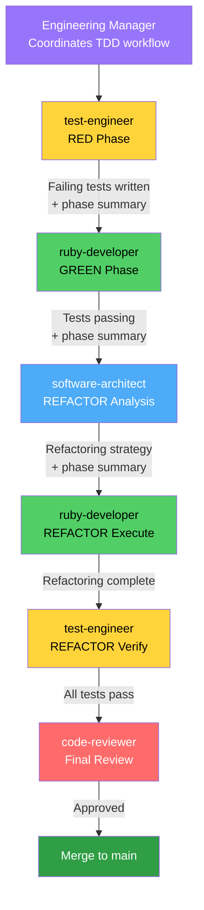
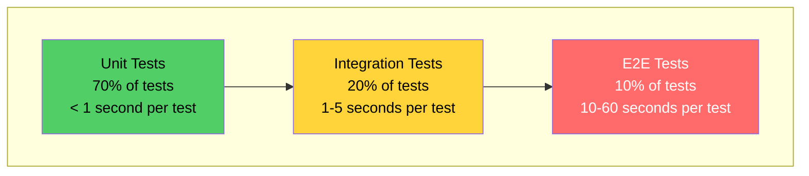

# Test-Driven Development (TDD) Workflow

## Introduction

This document defines the Test-Driven Development workflow for the Vagrant OrbStack Provider project. TDD is **mandatory for all code development**—no code is written without corresponding tests.

### Why TDD?

From our project principles: "We will always prioritize quality above expedience."

**Benefits:**
- **Confidence**: Tests verify behavior before and after changes
- **Design**: Writing tests first leads to better API design
- **Documentation**: Tests document how code should behave
- **Regression Prevention**: Tests catch breaking changes immediately
- **Refactoring Safety**: Change implementation without breaking behavior

### Project Testing Commitment

**Zero code without tests.** This means:
- All new features require tests written FIRST
- All bug fixes require regression tests
- All refactorings must maintain passing tests
- Test coverage is monitored via `baseline-check` skill

This is not optional. Quality is our priority.

---

## RED-GREEN-REFACTOR Cycle

TDD follows a simple three-phase cycle that repeats for every feature:


### Agent Delegation Flow

The TDD cycle involves coordination between specialized agents:



### The Three Phases

| Phase | Goal | Owner | Think Level |
|-------|------|-------|-------------|
| **RED** | Write failing test that specifies exact behavior | test-engineer | Conservative |
| **GREEN** | Write minimal code to make test pass | ruby-developer | Conservative |
| **REFACTOR** | Analyze and improve design without changing behavior | software-architect → ruby-developer → test-engineer | Conservative |

**Conservative Think Level:** Each phase should use thorough analysis to consider edge cases, design implications, and quality.

---

## TDD Phase Artifacts

Each TDD phase creates a summary document for handoff to the next phase. These are **temporary coordination files** stored in `/tmp/` and **must not be committed** to the repository.

### Purpose

Phase artifacts serve as detailed handoff documentation between agents:
- Preserve context across agent transitions
- Document decisions and rationale
- Provide clear implementation guidance
- Enable session continuity via `/write-handoff` and `/read-handoff`
- Keep coordination separate from production code

### Naming Convention

```
/tmp/{issue-id}-red-phase-summary.md
/tmp/{issue-id}-green-phase-summary.md
/tmp/{issue-id}-refactor-phase-summary.md
```

**Examples:**
- `/tmp/SPI-1130-red-phase-summary.md`
- `/tmp/SPI-1131-green-phase-summary.md`
- `/tmp/SPI-1132-refactor-phase-summary.md`

### Phase Workflows

#### RED Phase Summary (test-engineer creates)

**File**: `/tmp/{issue-id}-red-phase-summary.md`

**Contents:**
- Test files created and their purposes
- Test failure messages (proving tests fail)
- Expected behavior specification
- Implementation guidance for ruby-developer
- Edge cases to consider
- Mock/stub requirements

**Example Structure:**
```markdown
# RED Phase Summary: SPI-1131 Configuration Validation

## Tests Created
- spec/unit/vagrant-orbstack/config_spec.rb (22 tests)
- All tests FAIL as expected

## Failure Messages
- LoadError: cannot load such file 'vagrant-orbstack/config'
- NameError: uninitialized constant VagrantPlugins::OrbStack::Config

## Implementation Guidance
ruby-developer should create:
1. lib/vagrant-orbstack/config.rb
2. Implement Config class with: distro, version, machine_name attributes
3. Implement validate, finalize!, initialize methods

## Edge Cases
- Handle UNSET_VALUE vs nil distinction
- Default values in finalize!
- Validation errors return proper hash structure
```

#### GREEN Phase Summary (ruby-developer creates)

**File**: `/tmp/{issue-id}-green-phase-summary.md`

**Contents:**
- Implementation files created
- Implementation approach taken
- Test results (all passing)
- Areas noted for refactoring
- Technical decisions made
- Known limitations or stubs

**Example Structure:**
```markdown
# GREEN Phase Summary: SPI-1131 Configuration Validation

## Implementation Complete
- lib/vagrant-orbstack/config.rb (60 lines)
- All 22 tests passing

## Implementation Approach
- Used Vagrant::UNSET_VALUE sentinel pattern
- Implemented three-phase lifecycle: initialize → finalize! → validate
- Defaults: distro='ubuntu', version=nil, machine_name=nil

## Areas for Refactoring
- Validation logic in single method (may need extraction if grows)
- Magic string "OrbStack Provider" for error namespace
- Could benefit from YARD documentation

## Test Results
✓ 22 examples, 0 failures
✓ All config attributes working
✓ Validation interface correct
```

#### REFACTOR Phase Summary (software-architect creates)

**File**: `/tmp/{issue-id}-refactor-phase-summary.md`

**Contents:**
- Code quality analysis
- Refactoring strategy (prioritized)
- Patterns to apply
- Ruby style issues
- Performance considerations
- Final implementation state after refactoring

**Example Structure:**
```markdown
# REFACTOR Phase Summary: SPI-1131 Configuration Validation

## Analysis
Code is well-structured. Minor improvements needed:
- RuboCop: 5 offenses (style only)
- Missing YARD documentation
- Accessor grouping opportunity

## Refactoring Strategy
**P1 (Must Fix):** None - no critical issues
**P2 (Should Fix):**
- Add YARD documentation
- Group attr_accessor declarations
- Fix RuboCop offenses

## Implementation Complete
- All refactorings applied
- Tests still passing (22 examples, 0 failures)
- RuboCop: 0 offenses
- YARD documentation complete
```

### Reading Phase Artifacts

**Each agent reads the previous phase's summary:**

- **GREEN phase (ruby-developer)** reads: `/tmp/{issue-id}-red-phase-summary.md`
- **REFACTOR phase (software-architect)** reads: `/tmp/{issue-id}-green-phase-summary.md`
- **REFACTOR implementation (ruby-developer)** reads: `/tmp/{issue-id}-refactor-phase-summary.md`

### Cleanup Protocol

Phase summaries are temporary and should be cleaned up after PR merge:

```bash
# After PR merged
rm /tmp/{issue-id}-*-phase-summary.md

# Or clean all phase summaries
rm /tmp/*-phase-summary.md
```

### Integration with Handoff Commands

**`/write-handoff` includes phase artifacts:**
```markdown
## TDD Phase Artifacts
- RED: /tmp/SPI-1130-red-phase-summary.md
- GREEN: /tmp/SPI-1130-green-phase-summary.md
- REFACTOR: /tmp/SPI-1130-refactor-phase-summary.md
- Status: REFACTOR phase complete
```

**`/read-handoff` references artifacts:**
```markdown
TDD Status: REFACTOR phase
Last artifact: /tmp/SPI-1130-refactor-phase-summary.md
Next step: test-engineer verification
```

### Why /tmp/?

**Benefits of using `/tmp/` for phase artifacts:**
1. **Not production code**: Clear separation from codebase
2. **Git ignored**: Won't be accidentally committed (via .gitignore pattern)
3. **Session-scoped**: Natural cleanup when session ends
4. **Fast access**: No path complexity
5. **Standard location**: Predictable for all agents

**Important**: Add pattern to `.gitignore` to prevent accidental commits:
```gitignore
# TDD phase summary artifacts
*-red-phase-summary.md
*-green-phase-summary.md
*-refactor-phase-summary.md
```

---

## Phase 1: RED - Write Failing Test

**Owner:** test-engineer

**Objective:** Specify the exact behavior you want to implement through a failing test.

### Process

1. **Understand the Requirement**
   - Read Linear issue and acceptance criteria
   - Review design docs for technical approach
   - Clarify any ambiguities before writing test

2. **Write the Test**
   - Test should describe ONE specific behavior
   - Use clear, descriptive test name
   - Follow AAA pattern (Arrange, Act, Assert)
   - Mock external dependencies (OrbStack CLI, Vagrant internals)

3. **Verify Test Fails**
   - Run the test
   - Confirm it fails with clear, informative message
   - If test passes or error is unclear, revise test

4. **Explain Expected Behavior**
   - Document what implementation should do to pass test
   - Note any edge cases or constraints
   - Hand off to ruby-developer for GREEN phase

### RED Phase Best Practices

**Do:**
- Write one focused test at a time
- Use descriptive test names that read like sentences
- Mock external dependencies (OrbStack CLI, filesystem, network)
- Consider edge cases and error conditions
- Make failure message informative
- Follow testing pyramid (prefer unit tests)

**Don't:**
- Write multiple tests before implementing
- Write tests that pass immediately
- Test implementation details—test behavior
- Create brittle tests tied to exact output strings
- Skip edge cases or error handling tests

### Example: RED Phase

```ruby
# spec/unit/vagrant-orbstack/provider_spec.rb
RSpec.describe VagrantPlugins::OrbStack::Provider do
  let(:machine) { double("machine", name: "test-vm", data_dir: "/tmp") }
  let(:provider) { described_class.new(machine) }

  describe "#state" do
    context "when machine is running" do
      it "returns :running state" do
        # Arrange: Mock OrbStack CLI to return "running"
        allow(Vagrant::Util::Subprocess).to receive(:execute)
          .with("orb", "status", "vagrant-test-vm-123")
          .and_return(double(exit_code: 0, stdout: "running\n", stderr: ""))

        # Act: Query machine state
        state = provider.state

        # Assert: Should return running state
        expect(state.id).to eq(:running)
        expect(state.short_description).to eq("running")
      end
    end
  end
end
```

**Run test:**
```bash
$ bundle exec rspec spec/unit/vagrant-orbstack/provider_spec.rb

Failures:
  1) VagrantPlugins::OrbStack::Provider#state when machine is running returns :running state
     Failure/Error: state = provider.state
     NoMethodError:
       undefined method `state' for #<VagrantPlugins::OrbStack::Provider>
```

**Perfect!** Test fails with clear message. Hand off to ruby-developer.

---

## Phase 2: GREEN - Make Test Pass

**Owner:** ruby-developer

**Objective:** Write minimal code to make the failing test pass. Don't refactor yet—just make it work.

### Process

1. **Understand the Test**
   - Read the failing test from test-engineer
   - Understand expected behavior
   - Review failure message

2. **Write Minimal Implementation**
   - Focus on making THIS test pass
   - Don't add features not tested
   - Don't refactor or optimize
   - Keep it simple and direct
   - Use conservative think level to consider edge cases

3. **Run Tests**
   - Run the specific test
   - Confirm it now passes
   - Run full test suite to ensure no regressions

4. **Hand Off to REFACTOR Phase**
   - Implementation works, tests pass
   - Ready for architectural analysis
   - Don't refactor yet—that's next phase

### GREEN Phase Best Practices

**Do:**
- Write simplest code that passes test
- Focus on behavior, not elegance
- Use conservative think level for edge cases
- Run tests frequently
- Commit when tests pass (small commits)

**Don't:**
- Refactor during GREEN phase (wait for REFACTOR)
- Add features not covered by tests
- Optimize prematurely
- Worry about duplication yet
- Skip running full test suite

### GREEN Phase Constraints

**Critical:** Do NOT refactor in GREEN phase. Resist the urge to:
- Extract methods
- Apply design patterns
- Remove duplication
- Improve naming

These are REFACTOR phase activities. GREEN is about making tests pass with minimal code.

### Example: GREEN Phase

```ruby
# lib/vagrant-orbstack/provider.rb
module VagrantPlugins
  module OrbStack
    class Provider < Vagrant.plugin("2", :provider)
      def initialize(machine)
        @machine = machine
      end

      # Minimal implementation to pass test
      def state
        machine_id = "vagrant-#{@machine.name}-123"
        result = Vagrant::Util::Subprocess.execute("orb", "status", machine_id)

        # Simple conditional to pass test
        if result.stdout.include?("running")
          return Vagrant::MachineState.new(:running, "running", "Machine is running")
        end

        # Fallback
        Vagrant::MachineState.new(:not_created, "not created", "Machine does not exist")
      end
    end
  end
end
```

**Run test:**
```bash
$ bundle exec rspec spec/unit/vagrant-orbstack/provider_spec.rb
.

Finished in 0.05 seconds
1 example, 0 failures
```

**Success!** Test passes. Time for REFACTOR phase.

---

## Phase 3: REFACTOR - Improve Design

**Owner:** software-architect → ruby-developer → test-engineer

**Objective:** Improve code design, remove duplication, apply patterns—without changing behavior.

### The REFACTOR Team

This phase involves three agents in sequence:

1. **software-architect**: Analyzes code and provides refactoring strategy
2. **ruby-developer**: Implements the refactoring strategy
3. **test-engineer**: Verifies all tests still pass

### Process

#### Step 3.1: software-architect Analysis

**software-architect reviews implementation and provides strategy:**

```
ANALYSIS: Provider#state Method

CODE SMELLS DETECTED:
1. Magic number "123" in machine_id construction
2. Primitive Obsession: String parsing for state determination
3. Multiple responsibilities: ID generation + CLI execution + state parsing

PATTERNS TO APPLY:
1. Extract Method: Separate machine ID generation
2. State Object Pattern: Centralize state parsing logic

RECOMMENDED REFACTORING STRATEGY:

1. Extract machine_id generation to separate method
   - Improves testability
   - Single responsibility
   - Eliminates magic number

2. Consider StateFactory pattern for state parsing (defer if only one state type for now—YAGNI)

IMPLEMENTATION GUIDANCE:
- Create private method: machine_id
- Use consistent ID generation based on machine name and data_dir
- Keep state parsing inline for now (will extract when more states added)

RATIONALE: Addresses magic number and improves testability while
respecting YAGNI (not over-engineering state parsing yet).
```

#### Step 3.2: ruby-developer Implementation

**ruby-developer implements the refactoring strategy:**

```ruby
# lib/vagrant-orbstack/provider.rb
module VagrantPlugins
  module OrbStack
    class Provider < Vagrant.plugin("2", :provider)
      def initialize(machine)
        @machine = machine
      end

      def state
        result = Vagrant::Util::Subprocess.execute("orb", "status", machine_id)

        if result.stdout.include?("running")
          return Vagrant::MachineState.new(:running, "running", "Machine is running")
        end

        Vagrant::MachineState.new(:not_created, "not created", "Machine does not exist")
      end

      private

      # Generate consistent machine ID from machine name
      def machine_id
        "vagrant-#{@machine.name}-#{machine_id_hash}"
      end

      # Create deterministic hash from data directory
      def machine_id_hash
        Digest::MD5.hexdigest(@machine.data_dir.to_s)[0..7]
      end
    end
  end
end
```

#### Step 3.3: test-engineer Verification

**test-engineer runs full test suite:**

```bash
$ bundle exec rspec

Finished in 0.12 seconds
1 example, 0 failures
```

**All tests pass!** Refactoring successful.

### REFACTOR Phase Best Practices

**Do:**
- Analyze for duplication, code smells, pattern opportunities
- Apply SOLID principles
- Extract methods for clarity
- Remove magic numbers and strings
- Improve naming
- Run tests after each small refactoring
- Commit when tests pass

**Don't:**
- Change behavior (tests must still pass)
- Add new features (that's a new RED-GREEN-REFACTOR cycle)
- Over-engineer simple code (respect YAGNI)
- Refactor without test coverage
- Make multiple changes at once

### REFACTOR Phase Triggers

Refactor when you detect:
- **Duplication**: Same logic in multiple places
- **Long methods**: > 10-15 lines
- **Complex conditionals**: Nested if/case statements
- **Poor naming**: Unclear variable/method names
- **Mixed responsibilities**: Class/method doing too much
- **Code smells**: Feature Envy, Data Clumps, etc.

### Example: Complete RED-GREEN-REFACTOR Cycle

**Cycle for adding "stopped" state support:**

**RED (test-engineer):**
```ruby
context "when machine is stopped" do
  it "returns :stopped state" do
    allow(Vagrant::Util::Subprocess).to receive(:execute)
      .with("orb", "status", anything)
      .and_return(double(exit_code: 0, stdout: "stopped\n", stderr: ""))

    state = provider.state

    expect(state.id).to eq(:stopped)
  end
end
```

**Run:** Test fails (stopped state not implemented)

**GREEN (ruby-developer):**
```ruby
def state
  result = Vagrant::Util::Subprocess.execute("orb", "status", machine_id)

  if result.stdout.include?("running")
    return Vagrant::MachineState.new(:running, "running", "Machine is running")
  elsif result.stdout.include?("stopped")
    return Vagrant::MachineState.new(:stopped, "stopped", "Machine is stopped")
  end

  Vagrant::MachineState.new(:not_created, "not created", "Machine does not exist")
end
```

**Run:** Tests pass

**REFACTOR (software-architect → ruby-developer → test-engineer):**

**software-architect:**
```
CODE SMELL: Growing conditional complexity in state parsing

PATTERN: State Object Pattern / Factory

Now that we have multiple states, extract state parsing to StateFactory:
- Encapsulates state determination logic
- Single responsibility
- Easy to add new states
- Testable in isolation
```

**ruby-developer implements strategy, test-engineer verifies:**
```ruby
# lib/vagrant-orbstack/state_factory.rb
class StateFactory
  def self.from_cli_output(output)
    case output
    when /running/ then running_state
    when /stopped/ then stopped_state
    else not_created_state
    end
  end

  private

  def self.running_state
    Vagrant::MachineState.new(:running, "running", "Machine is running")
  end

  def self.stopped_state
    Vagrant::MachineState.new(:stopped, "stopped", "Machine is stopped")
  end

  def self.not_created_state
    Vagrant::MachineState.new(:not_created, "not created", "Machine does not exist")
  end
end

# lib/vagrant-orbstack/provider.rb
def state
  result = Vagrant::Util::Subprocess.execute("orb", "status", machine_id)
  StateFactory.from_cli_output(result.stdout)
end
```

**Run tests:** All pass. Refactoring complete.

---

## Testing Pyramid

Our testing strategy follows the testing pyramid with the following distribution:



### 70% Unit Tests (Base)

**Characteristics:**
- Fast execution (< 1 second per test)
- Isolated (no external dependencies)
- Mock external systems (OrbStack CLI, filesystem)
- Test single units of functionality
- Most tests should be unit tests

**What to Unit Test:**
- Configuration validation
- State parsing logic
- Machine ID generation
- Error handling
- Private method behavior

**Example:**
```ruby
RSpec.describe VagrantPlugins::OrbStack::Config do
  describe "#validate" do
    it "returns error when distro is nil" do
      config = described_class.new
      config.distro = nil

      errors = config.validate(double("machine"))

      expect(errors["OrbStack Provider"]).to include("distro must be specified")
    end
  end
end
```

### 20% Integration Tests (Middle)

**Characteristics:**
- Test interactions between components
- May use real subprocess calls (but mock OrbStack)
- Test action middleware chains
- Slower than unit tests (1-5 seconds)

**What to Integration Test:**
- Full action stacks
- Provider + actions + config interaction
- CLI wrapper + actions integration
- State transitions through action chains

**Example:**
```ruby
RSpec.describe "Machine Creation Flow", type: :integration do
  it "creates machine and transitions state" do
    machine = create_test_machine
    provider = machine.provider

    # Mock OrbStack CLI responses
    stub_orb_create_success
    stub_orb_status_running

    # Execute full action stack
    provider.action(:up)

    expect(provider.state.id).to eq(:running)
    expect(machine.id).not_to be_nil
  end
end
```

### 10% End-to-End Tests (Top)

**Characteristics:**
- Full workflow validation
- May require real OrbStack installation
- Slowest tests (10-60 seconds)
- Test complete user scenarios

**What to E2E Test:**
- `vagrant up --provider=orbstack`
- `vagrant ssh` connectivity
- `vagrant halt` and `vagrant destroy`
- Real machine lifecycle
- Error recovery scenarios

**Example:**
```ruby
RSpec.describe "Full Lifecycle", type: :acceptance do
  it "creates, accesses, and destroys machine" do
    Dir.mktmpdir do |dir|
      Dir.chdir(dir) do
        # Create Vagrantfile
        File.write("Vagrantfile", <<~RUBY)
          Vagrant.configure("2") do |config|
            config.vm.box = "ubuntu/jammy64"
            config.vm.provider :orbstack
          end
        RUBY

        # Run vagrant commands
        expect(system("vagrant up --provider=orbstack")).to be true
        expect(system("vagrant ssh -c 'echo hello'")).to be true
        expect(system("vagrant destroy -f")).to be true
      end
    end
  end
end
```

### Rationale for 70/20/10 Distribution

**Why 70% Unit Tests?**
- Fast feedback (entire suite runs in seconds)
- Easy to debug failures
- Guides good design (highly cohesive, loosely coupled)
- Cheap to maintain

**Why 20% Integration Tests?**
- Verify components work together correctly
- Catch integration bugs unit tests miss
- Test middleware chain behavior
- Balance speed with coverage

**Why 10% E2E Tests?**
- Validate user experience
- Catch issues only visible in full system
- Expensive to run and maintain
- Should be selective and high-value

---

## RSpec Best Practices for Vagrant Plugins

### Test Organization

```
spec/
  unit/                    # 70% of tests
    vagrant-orbstack/
      provider_spec.rb
      config_spec.rb
      action/
        create_spec.rb
        destroy_spec.rb
  integration/             # 20% of tests
    provider_integration_spec.rb
    cli_wrapper_spec.rb
  acceptance/              # 10% of tests
    lifecycle_spec.rb
  support/
    helpers.rb             # Shared test helpers
    mocks.rb               # Mock factories
```

### AAA Pattern (Arrange-Act-Assert)

Structure every test with three clear sections:

```ruby
it "creates machine with correct ID" do
  # Arrange: Set up test conditions
  machine = double("machine", name: "test-vm", data_dir: "/tmp/test")
  provider = Provider.new(machine)
  stub_cli_success

  # Act: Execute the behavior being tested
  result = provider.create_machine

  # Assert: Verify expected outcome
  expect(result).to be_truthy
  expect(provider.machine_id).to match(/^vagrant-test-vm-/)
end
```

### Mocking OrbStack CLI

Always mock external CLI calls in unit tests:

```ruby
# Mock successful CLI execution
allow(Vagrant::Util::Subprocess).to receive(:execute)
  .with("orb", "create", "ubuntu", anything)
  .and_return(double(
    exit_code: 0,
    stdout: "Machine created: vagrant-test-123\n",
    stderr: ""
  ))

# Mock CLI error
allow(Vagrant::Util::Subprocess).to receive(:execute)
  .with("orb", "create", anything)
  .and_return(double(
    exit_code: 1,
    stdout: "",
    stderr: "Error: OrbStack not running\n"
  ))
```

### Mocking Vagrant Internals

Create test doubles for Vagrant objects:

```ruby
let(:machine) do
  double("machine",
    name: "test-vm",
    provider_config: provider_config,
    data_dir: Pathname.new("/tmp/test"),
    ui: ui
  )
end

let(:provider_config) do
  double("config",
    distro: "ubuntu",
    version: "22.04"
  )
end

let(:ui) do
  double("ui").tap do |ui|
    allow(ui).to receive(:info)
    allow(ui).to receive(:error)
  end
end
```

### Test Helpers

Create reusable helpers in `spec/support/`:

```ruby
# spec/support/orbstack_mocks.rb
module OrbStackMocks
  def stub_orb_create_success(machine_name = "test-vm")
    allow(Vagrant::Util::Subprocess).to receive(:execute)
      .with("orb", "create", anything)
      .and_return(success_result("Machine created: #{machine_name}"))
  end

  def stub_orb_status_running
    allow(Vagrant::Util::Subprocess).to receive(:execute)
      .with("orb", "status", anything)
      .and_return(success_result("running"))
  end

  private

  def success_result(stdout)
    double(exit_code: 0, stdout: stdout, stderr: "")
  end
end

RSpec.configure do |config|
  config.include OrbStackMocks
end
```

### Descriptive Test Names

Test names should read like documentation:

```ruby
# Good: Clear, specific, behavior-focused
describe Provider do
  describe "#state" do
    context "when machine is running" do
      it "returns :running state" do
      end
    end

    context "when machine does not exist" do
      it "returns :not_created state" do
      end
    end

    context "when OrbStack CLI fails" do
      it "raises OrbStackError with error message" do
      end
    end
  end
end

# Bad: Vague, implementation-focused
describe Provider do
  it "works" do
  end

  it "tests state" do
  end
end
```

---

## Quality Gates

TDD enforces quality through strict gates at each phase:

### RED Phase Gates

- [ ] Test is written before implementation
- [ ] Test fails with clear, informative message
- [ ] Test describes specific behavior (not implementation)
- [ ] Test is focused (one assertion per test)
- [ ] External dependencies are mocked
- [ ] test-engineer confirms test failure before handoff

### GREEN Phase Gates

- [ ] Implementation makes failing test pass
- [ ] No refactoring performed yet
- [ ] All tests pass (new test + existing tests)
- [ ] Implementation is minimal (no extra features)
- [ ] ruby-developer confirms tests pass before handoff

### REFACTOR Phase Gates

- [ ] software-architect provides clear refactoring strategy
- [ ] ruby-developer implements strategy
- [ ] All tests still pass after refactoring
- [ ] Code quality improved (less duplication, clearer structure)
- [ ] test-engineer confirms no test failures
- [ ] Ready for code-reviewer final approval

### Overall Quality Gates (baseline-check)

The `baseline-check` skill enforces:
- [ ] Test count increases with new features
- [ ] No new test failures
- [ ] RuboCop offenses don't increase
- [ ] Code quality trend is stable or improving

**Critical Rule:** No implementation without corresponding tests. If `baseline-check` shows code added without test count increasing, work is blocked.

---

## Common TDD Scenarios

### Scenario 1: Adding a New Action

**Requirement:** Implement Halt action to stop running machines

**RED (test-engineer):**
```ruby
RSpec.describe VagrantPlugins::OrbStack::Action::Halt do
  describe "#call" do
    it "stops running machine" do
      env = { machine: machine, ui: ui }
      allow(cli_wrapper).to receive(:halt).with(machine_id)

      action = described_class.new(app, env)
      action.call(env)

      expect(cli_wrapper).to have_received(:halt).with(machine_id)
    end
  end
end
```

**Run:** Fails (Halt action doesn't exist)

**GREEN (ruby-developer):**
```ruby
module VagrantPlugins::OrbStack::Action
  class Halt
    def initialize(app, env)
      @app = app
      @env = env
    end

    def call(env)
      machine_id = env[:machine].id
      cli_wrapper = CLIWrapper.new
      cli_wrapper.halt(machine_id)
      @app.call(env)
    end
  end
end
```

**Run:** Tests pass

**REFACTOR (software-architect → ruby-developer → test-engineer):**
```
ANALYSIS: Halt action is straightforward, no refactoring needed

Good practices observed:
- Clear single responsibility
- Delegates to CLIWrapper (good separation)
- Follows action middleware pattern

RECOMMENDATION: No refactoring needed. Proceed as-is.
```

**Run:** Tests pass. Complete.

### Scenario 2: Error Handling

**Requirement:** Handle OrbStack CLI errors gracefully

**RED (test-engineer):**
```ruby
context "when OrbStack CLI fails" do
  it "raises OrbStackError with CLI error message" do
    allow(Vagrant::Util::Subprocess).to receive(:execute)
      .and_return(double(exit_code: 1, stdout: "", stderr: "OrbStack not running"))

    expect { provider.state }.to raise_error(
      VagrantPlugins::OrbStack::Errors::OrbStackError,
      /OrbStack not running/
    )
  end
end
```

**Run:** Fails (error not raised)

**GREEN (ruby-developer):**
```ruby
def state
  result = Vagrant::Util::Subprocess.execute("orb", "status", machine_id)

  if result.exit_code != 0
    raise Errors::OrbStackError, result.stderr
  end

  StateFactory.from_cli_output(result.stdout)
end
```

**Run:** Tests pass

**REFACTOR (software-architect → ruby-developer → test-engineer):**
```
CODE SMELL: Error handling duplicated across all provider methods

PATTERN: Aspect-Oriented Programming / Decorator

Extract CLI error handling to CLIWrapper so all methods benefit.

(Refactoring strategy provided, implemented, verified)
```

### Scenario 3: Configuration Validation

**Requirement:** Validate that distro is from allowed list

**RED (test-engineer):**
```ruby
describe "#validate" do
  context "when distro is not in allowed list" do
    it "returns error message" do
      config.distro = "invalid-distro"

      errors = config.validate(machine)

      expect(errors["OrbStack Provider"]).to include(
        "distro must be one of: ubuntu, debian, fedora"
      )
    end
  end
end
```

**Run:** Fails (validation not implemented)

**GREEN (ruby-developer):**
```ruby
ALLOWED_DISTROS = %w[ubuntu debian fedora].freeze

def validate(machine)
  errors = []

  if distro && !ALLOWED_DISTROS.include?(distro)
    errors << "distro must be one of: #{ALLOWED_DISTROS.join(', ')}"
  end

  { "OrbStack Provider" => errors }
end
```

**Run:** Tests pass

**REFACTOR:**
```
ANALYSIS: Validation is clear and simple. No refactoring needed.
When more validations are added, consider validation object pattern.
```

### Scenario 4: Design Flaw Discovery During TDD

**Requirement:** Sometimes during RED or GREEN phase, you realize the current design won't work

**Context:**

You're in the middle of a TDD cycle and discover that:
- The test reveals a fundamental design flaw
- The approach won't scale to handle edge cases
- There's a conflict with existing architecture
- The implementation is becoming unreasonably complex

**Example:**

During GREEN phase for implementing CLI timeout handling, ruby-developer realizes the timeout mechanism conflicts with the state caching strategy—timeouts need immediate feedback, but the cache assumes state is stable for at least 30 seconds.

**Decision Point: Stop and Revisit Design**

When you discover a design flaw during TDD:

**DON'T:**
- Push through with a hacky workaround
- Add complexity to "make it work"
- Skip writing tests for the problematic area
- Defer the issue to "fix later"

**DO:**
1. **Acknowledge the Issue**
   - Stop the current TDD cycle
   - Document what you discovered
   - Explain why the current approach won't work

2. **Document in Phase Summary**
   - Write to `/tmp/{issue-id}-design-flaw.md`
   - Describe the conflict or limitation
   - Explain impact on the feature
   - Note which tests revealed the issue

3. **Revisit Design**
   - Consult DESIGN.md for architectural constraints
   - Consider alternative approaches
   - Discuss with software-architect for guidance
   - Update design if needed

4. **Delete or Modify Tests**
   - If tests are based on flawed design, update them
   - Don't keep tests for a design you're not implementing
   - Restart RED phase with corrected tests

5. **Restart TDD Cycle**
   - Begin fresh RED-GREEN-REFACTOR with revised design
   - Tests should reflect the new approach
   - Clean up any implementation from abandoned approach

**Resolution:**

```markdown
# Design Flaw Discovery: CLI Timeout vs State Cache

## Issue Discovered
During GREEN phase for SPI-1155 (CLI timeout handling), discovered that
immediate timeout feedback conflicts with 30-second state cache TTL.

## Why Current Design Won't Work
- Timeout needs instant response (1-2 seconds)
- State cache assumes machine state is stable for 30 seconds
- User running `vagrant status` during a timeout would get stale "running"
  state from cache instead of timeout error
- This violates the principle of least surprise

## Impact
- Current tests assume cache and timeout coexist
- GREEN phase implementation is becoming convoluted with cache bypass logic
- Risk of confusing user experience

## Revised Approach
After consulting DESIGN.md and software-architect:
1. Change cache strategy to per-operation rather than global
2. Status queries bypass cache when timeout is configured
3. Other operations (up, halt) still benefit from cache

## Actions Taken
1. Deleted tests in `spec/unit/provider_spec.rb` lines 45-67 (timeout with cache)
2. Revised tests to reflect per-operation cache strategy
3. Updated `/tmp/SPI-1155-red-phase-summary.md` with new test expectations
4. Restarting RED phase with corrected design

## Rationale
Better to discover design flaws during TDD than after shipping to users.
The cycle gave us fast feedback that cache + timeout was problematic.
Restarting now saves future technical debt.
```

**Key Insight:**

TDD's value isn't just in catching bugs—it's in discovering design flaws **early** when they're cheap to fix. If writing tests feels awkward or implementation is getting convoluted, trust that signal. Stop, reassess, and restart the cycle with better design.

**When to Restart vs Push Through:**

**Restart the cycle when:**
- Core design assumption is wrong
- Tests are revealing architecture conflicts
- Implementation complexity is escalating rapidly
- You're adding workarounds to satisfy tests

**Push through when:**
- Minor naming or structure issue (can refactor)
- Edge case you hadn't considered (add test, handle it)
- Implementation is straightforward but tedious
- Tests are clear and passing

---

## Agent Delegation Pattern in TDD

When following TDD, agent delegation follows this pattern:

```
User: "Implement machine halt functionality"

Engineering Manager delegates:

1. RED Phase
   └─> test-engineer
       - Write failing tests for halt functionality
       - Verify tests fail with clear messages
       - Document expected behavior

2. GREEN Phase
   └─> ruby-developer
       - Implement minimal halt functionality
       - Make tests pass
       - Don't refactor yet

3. REFACTOR Phase
   └─> software-architect
       - Analyze implementation for patterns, duplication
       - Provide refactoring strategy
       └─> ruby-developer
           - Implement refactoring strategy
           - Keep tests passing
           └─> test-engineer
               - Verify all tests still pass
               - Confirm no regressions

4. Review Phase
   └─> code-reviewer
       - Final quality review
       - Security check
       - Approve for merge
```

**Engineering Manager enforces:**
- No skipping RED phase (tests first!)
- No refactoring in GREEN phase (wait for REFACTOR)
- No implementation without tests
- Conservative think levels at each phase
- Quality gates via `baseline-check`

---

## Integration with Project Workflow

### baseline-check Integration

The `baseline-check` skill tracks TDD compliance:

**Before Development (Establishes Baseline):**
```
RuboCop: 0 offenses
RSpec: 0 examples, 0 failures
```

**After RED Phase:**
```
RuboCop: 0 offenses (no code written yet)
RSpec: 1 example, 1 failure ← Test exists and fails
```

**After GREEN Phase:**
```
RuboCop: 2 offenses (new code, not refactored yet)
RSpec: 1 example, 0 failures ← Test passes
```

**After REFACTOR Phase:**
```
RuboCop: 0 offenses ← Improved
RSpec: 1 example, 0 failures ← Still passing
```

### /develop Command Integration

When `/develop` is invoked, the development plan includes TDD workflow:

```markdown
## TDD Workflow

This feature will be developed following RED-GREEN-REFACTOR cycle:

### RED Phase (test-engineer)
- Write failing tests for halt action
- Verify tests fail with clear messages
- Test files: spec/unit/action/halt_spec.rb

### GREEN Phase (ruby-developer)
- Implement minimal halt action
- Don't refactor yet - just make it work
- Implementation files: lib/vagrant-orbstack/action/halt.rb

### REFACTOR Phase
1. **software-architect**: Analyze for patterns, duplication, design improvements
2. **ruby-developer**: Implement refactoring strategy
3. **test-engineer**: Verify all tests still pass

### Test Coverage Target
- Unit tests: Halt action behavior, error handling, state transitions
- Integration tests: Full halt workflow with provider
- Expected coverage: 100% of halt action code paths
```

### Handoff Document Integration

Session handoffs track TDD status:

```markdown
## TDD Status

**Current Phase**: REFACTOR

**Test Coverage**:
- Unit tests: 15 examples, 0 failures
- Integration tests: 3 examples, 0 failures
- Overall: 87% coverage (from latest baseline-check)

**Pending Tests**:
- [ ] Error handling when OrbStack is not running
- [ ] Timeout behavior for long operations

**Technical Debt** (from software-architect):
- CLI execution duplicated across actions (extract CLIWrapper)
- State parsing could benefit from Factory pattern

**TDD Workflow Notes**:
- Completed GREEN phase for halt action
- software-architect recommended CLIWrapper extraction
- Next: ruby-developer implements refactoring
```

---

## Anti-Patterns to Avoid

### Testing Anti-Patterns

**❌ Writing Tests After Implementation**
- Defeats TDD purpose
- Tests less thorough (written to pass, not specify behavior)
- Temptation to skip edge cases

**✓ Always write tests first (RED phase)**

**❌ Skipping RED Phase Verification**
- Writing test but not confirming it fails
- Test might be passing for wrong reasons

**✓ Always verify test fails before implementing**

**❌ Refactoring During GREEN Phase**
- Mixing concerns (making tests pass + improving design)
- Harder to debug if tests fail

**✓ Keep GREEN simple, refactor in REFACTOR phase**

**❌ Testing Implementation Details**
- Brittle tests that break with refactoring
- Coupling tests to internal structure

**✓ Test behavior and outcomes, not implementation**

**❌ One Test for Everything**
- Hard to debug failures
- Unclear what behavior is being tested

**✓ One focused test per behavior**

### Development Anti-Patterns

**❌ Writing Code Without Tests**
- No safety net for refactoring
- Unclear specifications
- Risk of regressions

**✓ No code without tests (enforced by baseline-check)**

**❌ Skipping REFACTOR Phase**
- Technical debt accumulates
- Code quality degrades over time

**✓ Always refactor after making tests pass**

**❌ Over-Engineering in REFACTOR**
- Adding patterns that aren't needed (violates YAGNI)
- Premature optimization

**✓ Refactor based on actual issues, not hypothetical futures**

**❌ Large RED-GREEN-REFACTOR Cycles**
- Implementing entire feature before tests
- Hard to debug failures

**✓ Small cycles (one behavior at a time)**

---

## Common TDD Mistakes (Vagrant Plugin Context)

These mistakes are specific to Vagrant plugin development and easy to make when first learning TDD:

### Mistake 1: Testing Vagrant's Internals

**Wrong:**
```ruby
# Testing Vagrant's behavior instead of our provider
RSpec.describe VagrantPlugins::OrbStack::Provider do
  it "creates correct MachineState object" do
    state = provider.state

    # Testing Vagrant::MachineState internals
    expect(state).to be_a(Vagrant::MachineState)
    expect(state.instance_variable_get(:@id)).to eq(:running)
    expect(state.instance_variable_get(:@short_description)).to eq("running")
  end
end
```

**Why it's wrong:**
- Testing Vagrant framework behavior, not our code
- Brittle (coupled to Vagrant's implementation)
- Doesn't test what our provider does

**Right:**
```ruby
# Testing our provider's behavior
RSpec.describe VagrantPlugins::OrbStack::Provider do
  it "returns running state when machine is running" do
    allow(cli_wrapper).to receive(:status).and_return("running")

    state = provider.state

    # Test the contract our provider fulfills
    expect(state.id).to eq(:running)
    expect(state.short_description).to eq("running")
  end
end
```

**Why it's right:**
- Tests our code's behavior (parsing CLI output → returning state)
- Tests the public interface/contract
- Focuses on what users/Vagrant care about

---

### Mistake 2: Integration Tests Without Mocks

**Wrong:**
```ruby
# Integration test calling real OrbStack CLI
RSpec.describe "Machine Creation", type: :integration do
  it "creates machine via OrbStack" do
    provider = create_provider

    # This actually calls `orb create`
    provider.action(:up)

    # Assertions on real machine state
    expect(provider.state.id).to eq(:running)
  end
end
```

**Why it's wrong:**
- Requires OrbStack installed and running
- Slow (actual VM creation)
- Flaky (network, system state)
- Can't test error conditions easily
- Pollutes system with test VMs

**Right:**
```ruby
# Integration test with mocked CLI calls
RSpec.describe "Machine Creation", type: :integration do
  before do
    # Mock OrbStack CLI responses
    allow(Vagrant::Util::Subprocess).to receive(:execute)
      .with("orb", "create", anything)
      .and_return(double(exit_code: 0, stdout: "machine-123\n", stderr: ""))

    allow(Vagrant::Util::Subprocess).to receive(:execute)
      .with("orb", "status", anything)
      .and_return(double(exit_code: 0, stdout: "running\n", stderr: ""))
  end

  it "creates machine via provider action stack" do
    provider = create_provider

    # Tests action middleware chain, not real OrbStack
    provider.action(:up)

    expect(provider.state.id).to eq(:running)
    expect(provider.machine.id).to eq("machine-123")
  end
end
```

**Why it's right:**
- Fast (no real VMs created)
- Reliable (deterministic mocks)
- Tests integration of our components (action chain, provider, config)
- Can test error scenarios by mocking failures
- Doesn't require OrbStack installation

---

### Mistake 3: Skipping RED Verification

**Wrong:**
```ruby
# Write test, immediately implement without verifying failure
RSpec.describe Provider do
  it "halts running machine" do
    provider.halt
    expect(cli_wrapper).to have_received(:halt)
  end
end

# Immediately implement halt method
def halt
  cli_wrapper.halt(machine_id)
end
```

**Why it's wrong:**
- Never verified test actually fails
- Test might pass for wrong reasons (missing setup, wrong assertions)
- No guarantee test is actually testing behavior

**Right (4-step approach):**

**Step 1: Write test**
```ruby
RSpec.describe Provider do
  it "halts running machine" do
    provider.halt
    expect(cli_wrapper).to have_received(:halt).with(machine_id)
  end
end
```

**Step 2: Run test, see it fail**
```bash
$ bundle exec rspec spec/unit/provider_spec.rb

Failures:
  1) Provider halts running machine
     Failure/Error: provider.halt
     NoMethodError: undefined method `halt' for #<Provider>
```

**Step 3: Verify failure message is clear**
- ✓ Clear error (method doesn't exist)
- ✓ Points to what to implement
- ✓ Test setup is correct

**Step 4: Implement minimal code**
```ruby
def halt
  cli_wrapper.halt(machine_id)
end
```

**Run test again, see it pass**
```bash
$ bundle exec rspec spec/unit/provider_spec.rb
.

1 example, 0 failures
```

**Why it's right:**
- Confirms test actually tests the behavior
- Verifies test setup is correct
- Failure message guides implementation
- True RED-GREEN cycle

---

## TDD FAQ

### Q: What if the test is hard to write?

**A:** Hard-to-test code is often poorly designed. Use TDD to guide better design:
- If mocking is complex, consider dependency injection
- If setup is extensive, class may have too many dependencies
- If test is unclear, requirement may be ambiguous

### Q: Should I test private methods?

**A:** No. Test public interface. Private methods are implementation details.
- If private method needs testing, it might deserve its own class
- Test private methods indirectly through public methods

### Q: How much should I refactor?

**A:** Refactor until code is clear and DRY, but respect YAGNI:
- Remove duplication
- Improve naming
- Extract complex logic
- Apply patterns when they simplify
- Stop before over-engineering

### Q: What if I can't think of more tests?

**A:** Consider:
- Edge cases (empty input, nil values, boundaries)
- Error conditions (failures, exceptions, timeouts)
- State transitions (before/after scenarios)
- Integration scenarios (how components interact)

### Q: Can I write multiple tests at once?

**A:** In RED phase, write one test at a time and make it pass before writing next test. Helps maintain focus and small cycles.

### Q: What if refactoring breaks tests?

**A:** You're changing behavior, not refactoring. Refactoring means improving structure while maintaining behavior. If tests break, revert and reconsider approach.

### Q: How do I know when to stop testing?

**A:** You have enough tests when:
- All acceptance criteria covered
- Edge cases handled
- Error conditions tested
- Regression scenarios covered
- Confidence to refactor freely

Don't aim for 100% coverage, aim for confidence.

---

## Summary

**TDD is mandatory in this project:**
- Write tests FIRST (RED phase)
- Make tests pass with minimal code (GREEN phase)
- Improve design while maintaining tests (REFACTOR phase)

**Agent responsibilities:**
- **test-engineer**: RED phase (write failing tests)
- **ruby-developer**: GREEN phase (make tests pass) + REFACTOR execution
- **software-architect**: REFACTOR analysis (provide strategy)
- **code-reviewer**: Final review and approval

**Quality gates:**
- RED: Test fails with clear message
- GREEN: All tests pass
- REFACTOR: Tests still pass, design improved
- baseline-check: Tracks test count and quality trends

**Testing pyramid:**
- 70% unit tests (fast, isolated, mocked)
- 20% integration tests (component interactions)
- 10% E2E tests (full workflows)

**Core principle:** Test-first development leads to better design, higher quality, and confidence to refactor. Quality is our priority.

---

For more information:
- See agent files for specific TDD workflows: `test-engineer.md`, `ruby-developer.md`, `software-architect.md`
- See `baseline-check` skill for quality tracking
- See `/develop` command for TDD-integrated planning
