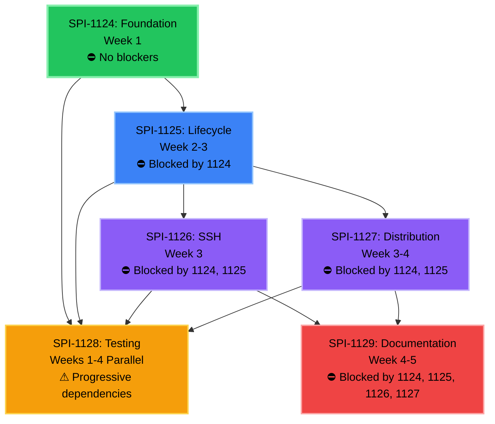
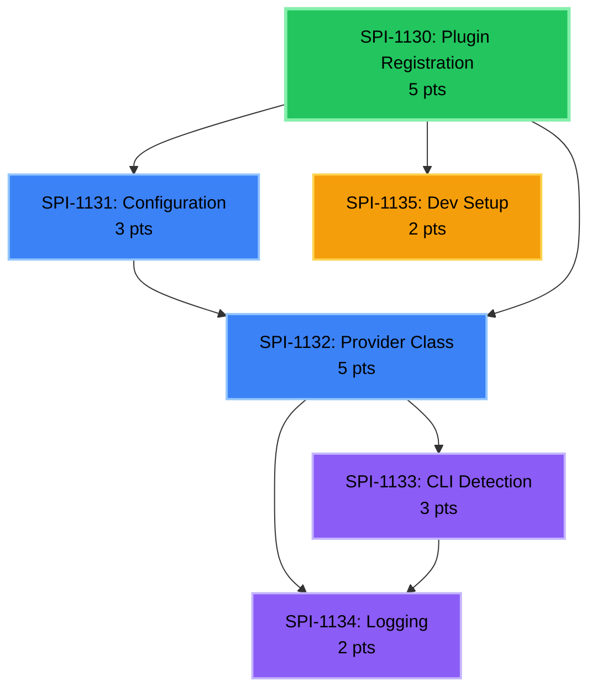

# Linear Issue Dependencies

## Epic Dependency Graph

```mermaid
 graph TD
      E1[SPI-1124: Foundation<br/>Week 1<br/>⛔ No blockers]
      E2[SPI-1125: Lifecycle<br/>Week 2-3<br/>⛔ Blocked by 1124]
      E3[SPI-1126: SSH<br/>Week 3<br/>⛔ Blocked by 1124, 1125]
      E4[SPI-1127: Distribution<br/>Week 3-4<br/>⛔ Blocked by 1124, 1125]
      E5[SPI-1128: Testing<br/>Weeks 1-4 Parallel<br/>⚠ Progressive dependencies]
      E6[SPI-1129: Documentation<br/>Week 4-5<br/>⛔ Blocked by 1124, 1125, 1126, 1127]

      E1 --> E2
      E1 --> E5
      E2 --> E3
      E2 --> E4
      E2 --> E5
      E3 --> E5
      E3 --> E6
      E4 --> E5
      E4 --> E6

      style E1 fill:#22c55e,stroke:#86efac,stroke-width:3px,color:#000
      style E2 fill:#3b82f6,stroke:#93c5fd,stroke-width:2px,color:#000
      style E3 fill:#8b5cf6,stroke:#c4b5fd,stroke-width:2px,color:#000
      style E4 fill:#8b5cf6,stroke:#c4b5fd,stroke-width:2px,color:#000
      style E5 fill:#f59e0b,stroke:#fcd34d,stroke-width:2px,color:#000
      style E6 fill:#ef4444,stroke:#fca5a5,stroke-width:2px,color:#000
```

## SPI-1124 Dependency Graph

```mermaid
  graph TD
      S1[SPI-1130: Plugin Registration<br/>5 pts]
      S2[SPI-1131: Configuration<br/>3 pts]
      S3[SPI-1132: Provider Class<br/>5 pts]
      S4[SPI-1133: CLI Detection<br/>3 pts]
      S5[SPI-1134: Logging<br/>2 pts]
      S6[SPI-1135: Dev Setup<br/>2 pts]

      S1 --> S2
      S1 --> S6
      S2 --> S3
      S1 --> S3
      S3 --> S4
      S3 --> S5
      S4 --> S5

      style S1 fill:#22c55e,stroke:#86efac,stroke-width:3px,color:#000
      style S2 fill:#3b82f6,stroke:#93c5fd,stroke-width:2px,color:#000
      style S3 fill:#3b82f6,stroke:#93c5fd,stroke-width:2px,color:#000
      style S4 fill:#8b5cf6,stroke:#c4b5fd,stroke-width:2px,color:#000
      style S5 fill:#8b5cf6,stroke:#c4b5fd,stroke-width:2px,color:#000
      style S6 fill:#f59e0b,stroke:#fcd34d,stroke-width:2px,color:#000
```